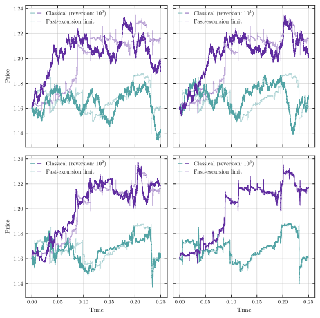

# Fast-excursion limit of the Heston model

[](https://github.com/ryanmccrickerd/fast-excursion-limit/actions/workflows/ci.yml)

Code and notebooks accompanying the article *Fast-excursion limit of the Heston model* ([arXiv:2606.06737](https://arxiv.org/abs/2606.06737)). Notebooks in `notebooks/figures/` generate the article's figures, saved to `plots/`. Here's a preview of Figure 1:

<p align="center"></p>

## Setup

```sh
pip install -e ".[dev]"
```

Notebooks assume you have a way to open `.ipynb` files (VS Code with the Jupyter extension, JupyterLab, classic Notebook, etc.) — none is bundled here.

Plots will try to use Latin Modern Roman font — install it to reproduce the figures with this font, otherwise matplotlib falls back to whatever serif font is available. On Mac:

```sh
brew install --cask font-latin-modern
```

Developed with [Claude Code](https://claude.com/claude-code) (Anthropic).
